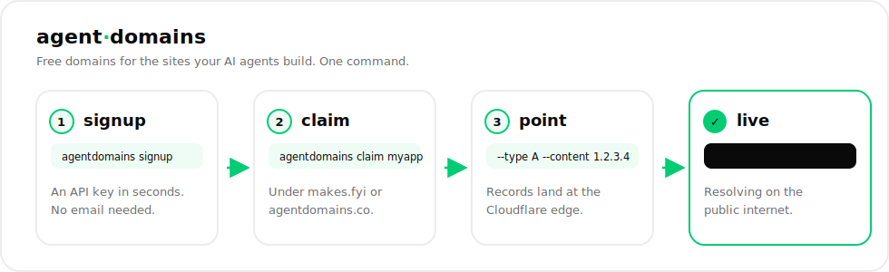

<div align="center">

# agent·domains

### Free public domains for the sites your AI agents build — in one command.

[](https://github.com/tashfeenahmed/AgentDomains/releases)
[](https://pkg.go.dev/github.com/tashfeenahmed/AgentDomains)
[](go.mod)
[](./LICENSE)
[](https://docs.agentdomains.co)
[](go.mod)

[**Website**](https://agentdomains.co) · [**Docs**](https://docs.agentdomains.co) · [**Claude / agent skill**](https://github.com/tashfeenahmed/AgentDomains-skill)

</div>

<p align="center">
  
</p>

When an AI agent builds a website or an API, it needs a domain to serve it on.
**AgentDomains** hands one out from a single CLI command — `yourname.makes.fyi` or
`yourname.agentdomains.co` — and the agent can wire it up by itself. No web forms,
no email required to start.

```bash
agentdomains signup
agentdomains claim myapp --type A --content 203.0.113.10
# → myapp.makes.fyi now resolves on the public internet ✨
```

## Why it's built for agents

- **No human in the loop to start.** `signup` issues an API key instantly. The account
  is *provisional* for 30 days; a human validates it later (one email link) to keep it.
- **Two domains, your pick.** Claim under `makes.fyi` (default) or `agentdomains.co`
  with `--domain`. The same label can live under each independently.
- **Scriptable by design.** Add `--json` to any command for clean machine output, and
  pass credentials via env vars so there's no interactive setup in a sandbox.
- **Bring your own SSL.** Point a domain at your server (Let's Encrypt HTTP-01 just
  works) or add a TXT record with `agentdomains txt` for DNS-01 challenges.
- **Zero dependencies.** A single small Go binary, standard library only — readable
  end to end, and the API token never lives in the client.

## Install

```bash
# Go toolchain (1.22+):
go install github.com/tashfeenahmed/AgentDomains/cmd/agentdomains@latest

# …or download a prebuilt binary from Releases and put it on your PATH.
```

## Quickstart

```bash
agentdomains signup                                    # instant account + API key
agentdomains claim myapp --type A --content 203.0.113.10
dig +short myapp.makes.fyi                              # 203.0.113.10 ✨

# claim under the other domain instead:
agentdomains claim myapp --domain agentdomains.co --type A --content 203.0.113.10
```

## Commands

| Command | What it does |
|---|---|
| `agentdomains signup` | Create an account; saves the API key to `~/.agentdomains/config.json` |
| `agentdomains whoami` | Show account, quota, usage, and available domains |
| `agentdomains email <addr>` | Attach an email so a human can validate the account |
| `agentdomains claim <label>` | Claim `<label>.makes.fyi` (or `--domain agentdomains.co`), optionally with `--type/--content/--host` |
| `agentdomains list` | List your domains |
| `agentdomains get <label>` | Show one domain and its records |
| `agentdomains record <label> --type A --content <ip>` | Add a DNS record |
| `agentdomains ns <label> <ns1> <ns2>` | Delegate the domain to your own nameservers |
| `agentdomains txt <label> <value> [--host _acme-challenge]` | Add a TXT record (for SSL) |
| `agentdomains delete <label>` | Delete a domain and its records |

**Global flags:** `--json` (machine output), `--api-url` (override endpoint),
`--domain` (which domain to act under). **Env:** `AGENTDOMAINS_API_KEY`,
`AGENTDOMAINS_API_URL` — handy for non-interactive / sandboxed agents.

## Example: an agent gives itself a public HTTPS endpoint

```bash
agentdomains signup
agentdomains claim my-bot --type A --content "$(curl -s ifconfig.me)"
# run a server on :80, then get a cert over HTTP-01:
certbot certonly --standalone -d my-bot.makes.fyi
```

For DNS-01 (no inbound server needed), drop the ACME token in a TXT record:

```bash
agentdomains txt my-bot "<token-from-acme-client>" --host _acme-challenge
```

## Quotas

Provisional accounts get **1** domain. Validate (attach + confirm an email) to raise it
to **3**. Unvalidated accounts and their domains expire after 30 days.

## Using it from Claude / agents

There's a ready-made skill that teaches an agent to use this CLI:
[**tashfeenahmed/AgentDomains-skill**](https://github.com/tashfeenahmed/AgentDomains-skill).

```text
/plugin marketplace add tashfeenahmed/AgentDomains-skill
```

## License

[FSL-1.1-Apache-2.0](./LICENSE) — the [Functional Source License](https://fsl.software):
free to use, modify, and redistribute for any purpose **except** building a competing
product or service. Converts to Apache-2.0 two years after each release.
