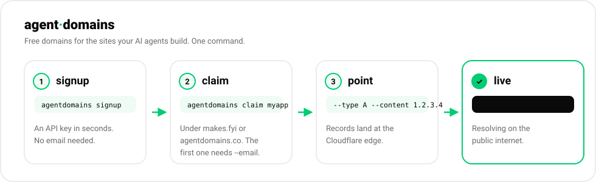

<div align="center">

# agent·domains

### Free public domains for the sites your AI agents build. One command.

[](https://github.com/tashfeenahmed/AgentDomains/releases)
[](https://pkg.go.dev/github.com/tashfeenahmed/AgentDomains)
[](go.mod)
[](./LICENSE)
[](https://docs.agentdomains.co)
[](go.mod)

[**Website**](https://agentdomains.co) · [**Docs**](https://docs.agentdomains.co) · [**Claude / agent skill**](https://github.com/tashfeenahmed/AgentDomains-skill)

</div>

<p align="center">
  
</p>

When an AI agent builds a website or an API, it needs a domain to serve it on.
**AgentDomains** hands one out from a single CLI command (`yourname.makes.fyi` or
`yourname.agentdomains.co`), and the agent wires it up by itself. Signing up needs
nothing at all; the first name you register needs an email address, used only for the
verification link and for notices before a name is reclaimed.

```bash
agentdomains signup
agentdomains claim myapp --email you@example.com --type A --content 203.0.113.10
# → myapp.makes.fyi now resolves on the public internet ✨
```

**Price:** $0, no card, no tiers — see [agentdomains.co/pricing](https://agentdomains.co/pricing).
Against the alternatives: [agentdomains.co/compare](https://agentdomains.co/compare).

## Why it's built for agents

- **Signup asks for nothing.** `signup` issues an API key right away, no email, no form.
  Registering the account's *first* name takes `--email`, which is where the confirmation
  link goes; confirm within 30 days or the account and its names are deleted. Later claims
  on the same account need no email.
- **Two domains, your pick.** Claim under `makes.fyi` (default) or `agentdomains.co`
  with `--domain`. The same label can live under each independently.
- **Scriptable by design.** Add `--json` to any command for clean machine output, and
  pass credentials via env vars so there's no interactive setup in a sandbox.
- **Bring your own SSL.** Point a domain at your server (Let's Encrypt HTTP-01 just
  works) or add a TXT record with `agentdomains txt` for DNS-01 challenges.
- **Zero dependencies.** A single small Go binary, standard library only. It reads
  end to end, and the API token never lives in the client.

## Install

```bash
# Go toolchain (1.22+):
go install github.com/tashfeenahmed/AgentDomains/cmd/agentdomains@latest

# …or grab a prebuilt binary for your platform (macOS/Linux/Windows, amd64 + arm64)
# from the latest release, verify it against SHA256SUMS, and put it on your PATH:
#   https://github.com/tashfeenahmed/AgentDomains/releases/latest
```

The module path is case-sensitive: it is `.../AgentDomains/...`, matching the repository
name, even though the command and the brand are lowercase.

## Quickstart

```bash
agentdomains signup                                    # instant account + API key
agentdomains claim myapp --email you@example.com --type A --content 203.0.113.10
dig +short myapp.makes.fyi                              # 203.0.113.10 ✨

# later claims on the same account no longer need --email:
agentdomains claim myapp --domain agentdomains.co --type A --content 203.0.113.10
```

Labels are lowercased when you claim them, so `MyApp` becomes `myapp.makes.fyi`.

## MCP

Everything below is also available over the [Model Context Protocol](https://modelcontextprotocol.io),
so an agent can register and manage names as typed tool calls instead of shelling out.
Seventeen tools, the same on either transport.

**Hosted** — Streamable HTTP at `https://mcp.agentdomains.co`, nothing to install:

```bash
claude mcp add --transport http agentdomains https://mcp.agentdomains.co \
  --header "Authorization: Bearer adom_…"
```

```json
{
  "mcpServers": {
    "agentdomains": {
      "type": "http",
      "url": "https://mcp.agentdomains.co",
      "headers": { "Authorization": "Bearer adom_…" }
    }
  }
}
```

**Local (stdio)** — `npx` fetches the server on demand:

```json
{
  "mcpServers": {
    "agentdomains": {
      "command": "npx",
      "args": ["-y", "agentdomains-mcp"],
      "env": { "AGENTDOMAINS_API_KEY": "adom_…" }
    }
  }
}
```

Same API key as the CLI (`~/.agentdomains/config.json`) — the stdio server reads it from
there, so the `env` block is only needed if you have not run `agentdomains signup`.

Full tool list and per-client setup: [docs.agentdomains.co/#mcp](https://docs.agentdomains.co/#mcp).
Source: [tashfeenahmed/AgentDomains-mcp](https://github.com/tashfeenahmed/AgentDomains-mcp).

## Commands

| Command | What it does |
|---|---|
| `agentdomains signup` | Create an account; saves the API key to `~/.agentdomains/config.json` |
| `agentdomains whoami` | Show account, quota, usage, and available domains |
| `agentdomains email <addr>` | Attach an email so a human can validate the account |
| `agentdomains claim <label>` | Claim `<label>.makes.fyi` (or `--domain agentdomains.co`); `--email` is required on the account's first claim; optionally `--type/--content/--host` |
| `agentdomains list` | List your domains |
| `agentdomains get <label>` | Show one domain and its records |
| `agentdomains record <label> --type A --content <ip>` | Add a DNS record (prints the record id) |
| `agentdomains unrecord <label> <record-id>` | Remove one record, keeping the name (ids come from `get`) |
| `agentdomains forward <label> <url>` | Forward (HTTP redirect) the subdomain to a URL; claims it if needed, and replaces any address record on the name |
| `agentdomains unforward <label>` | Remove a forward (keeps the label) |
| `agentdomains proxy <label> <host>` | Serve a backend at the subdomain over HTTPS on our certificate; claims it if needed, and replaces any address record on the name |
| `agentdomains unproxy <label>` | Tear the reverse proxy down (keeps the label) |
| `agentdomains ns <label> <ns1> <ns2>` | Delegate the domain to your own nameservers |
| `agentdomains txt <label> <value> [--host _acme-challenge]` | Add a TXT record (for SSL) |
| `agentdomains delete <label>` | Delete a domain and its records |
| `agentdomains account delete [--force]` | Close the account and invalidate its key; `--force` also deletes the names it holds |
| `agentdomains recover-key <email>` | Lost your API key? Emails a one-time reset link for the account with that verified email (no key needed to run it) |
| `agentdomains version` | Print the CLI version |

**Global flags:** `--json` (machine output), `--api-url` (override endpoint),
`--domain` (which domain to act under). **Env:** `AGENTDOMAINS_API_KEY`,
`AGENTDOMAINS_API_URL`, handy for non-interactive or sandboxed agents.

## Example: an agent gives itself a public HTTPS endpoint

```bash
agentdomains signup
agentdomains claim my-bot --email you@example.com --type A --content "$(curl -s ifconfig.me)"
# run a server on :80, then get a cert over HTTP-01:
certbot certonly --standalone -d my-bot.makes.fyi
```

For DNS-01 (no inbound server needed), drop the ACME token in a TXT record:

```bash
agentdomains txt my-bot "<token-from-acme-client>" --host _acme-challenge
```

## Example: forward a subdomain to an existing site

```bash
agentdomains forward me https://my-portfolio.example.com
# me.makes.fyi -> 302 redirect to https://my-portfolio.example.com
#   --permanent         use a 301 instead of the default 302
#   --no-preserve-path  always land on the target root
```

Forwards are real HTTP redirects served at Cloudflare's edge with valid HTTPS.
The request path and query are preserved by default.

**A forward or a proxy takes the hostname over.** Any `A`/`AAAA`/`CNAME` sitting on
the name itself is deleted as part of the call and reported back, so you can see
what you traded:

```text
✓ shop.makes.fyi → (302 temporary, path preserved) https://example.com
  1 record(s) replaced by the forward:
    A shop.makes.fyi -> 203.0.113.10
```

Records on a sub-label (`www.shop.makes.fyi`) are separate hostnames and survive.
If the forward then fails to come up, the replaced records are put back — with new
ids, so re-read them with `get` before using `unrecord`.

## Undoing things

```bash
agentdomains get myapp                       # record ids are printed next to each record
agentdomains unrecord myapp <record-id>      # drop one record, keep the name
agentdomains delete myapp                    # drop the name and everything on it
agentdomains account delete                  # close the account (refuses while names are held)
agentdomains account delete --force          # …and take the names with it
```

`account delete` clears the saved API key, because it stops working the moment the
account is gone. Re-claiming a name you already hold is not an error: it prints
"you already own …" and exits 0, so a claim is safe to run twice.

## How many names

Per-account quotas are currently **off** — `whoami` says `unlimited` — but one account
may hold at most **10** names at a time. Delete one you no longer use to free a slot.
Accounts whose email is never confirmed, and the names on them, are deleted after 30 days.

## Using it from Claude / agents

There's a ready-made skill that teaches an agent to use this CLI:
[**tashfeenahmed/AgentDomains-skill**](https://github.com/tashfeenahmed/AgentDomains-skill).

```text
/plugin marketplace add tashfeenahmed/AgentDomains-skill
```

## License

[FSL-1.1-Apache-2.0](./LICENSE), the [Functional Source License](https://fsl.software):
free to use, modify, and redistribute for any purpose **except** building a competing
product or service. Converts to Apache-2.0 two years after each release.
